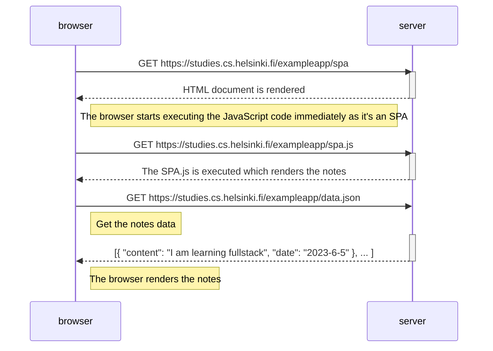

```mermaid
sequenceDiagram
  participant browser
  participant server

  browser->>server: GET https://studies.cs.helsinki.fi/exampleapp/spa
  activate server
  server-->>browser: HTML document is rendered
  deactivate server

  Note right of browser: The browser starts executing the JavaScript code immediately as it's an SPA

  browser->>server: GET https://studies.cs.helsinki.fi/exampleapp/spa.js

  activate server
  server-->>browser: The SPA.js is executed which renders the notes
  deactivate server

  browser->>server: GET https://studies.cs.helsinki.fi/exampleapp/data.json

  Note right of browser: Get the notes data

  activate server
  server-->>browser: [{ "content": "I am learning fullstack", "date": "2023-6-5" }, ... ]
  deactivate server

  Note right of browser: The browser renders the notes
```
